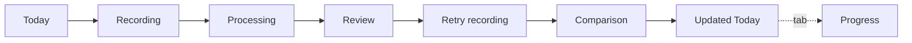

# Noum — V4.6 Production Ready · Handoff

**Date:** 2026-07-25 · **Page:** `233:819` **"16 V4.6 — Production Ready"** (brief said "13" — 13/15 were taken by V4.3/V4.5; numbering corrected, same as the V4.5 pass)
**Base:** V4.5 (page 15, untouched, preserved as history) · **Brief:** deep-research report 15 + founder V4.6 prompt (report 15 read the real V4.5 build log; brief executed as written apart from the page number and delete-vs-deprecate below).
**Figma:** https://www.figma.com/design/srCgE5IP3rWoNMWtHo3AnI/?node-id=233-819

## Verdict

**V4.6 is ready for founder review.** The subtraction brief is delivered: every dense screen lost a full text layer or more (~25–35% visible-text reduction per screen), hierarchy is stepped instead of flat, the trace reads as one object migrating through the loop (hero traces now share the centered axis with Recording/Processing), Comparison opens with the win before the explanation, Updated Today is a genuinely different state, and the prototype runs end-to-end with zero dead links. Items still needing founder eyes are flagged at the bottom.

## Flow (wired, 12 links, zero dead — verified by reading back every reaction)

Plus: Review ⇄ Explore-open (disclosure), silence/final-seconds → Processing, Processing cancel → Today, Processing AFTER_TIMEOUT 1.4s → Review (dissolve 600).

## Table A — screen scores (report-15 V4.5 baseline → V4.6)

| Screen | Node | V4.5 → V4.6 | Rationale |
|---|---|---|---|
| Today | `233:820` | 7.6 → **8.4** | Reason compressed to one line ("Opening held twice — today it meets pressure."), body/meta/tertiary stepped 85/70/60%, trace centered on the Recording axis — integrated, not ornamental. |
| Recording — live | `233:867` | 8.6 → **8.6** | Deliberately untouched (strongest screen); transitions annotated on sheets. |
| Processing | `233:880` | 7.9 → **7.9** | Wiring + RM mapping complete; further art direction deliberately deferred — flagged below. |
| Review | `233:892` | 7.2 → **8.2** | Helper demoted to one small muted clause; improved phrase now 24pt and unmistakably the hero; provenance + verified wording untouched. |
| Retry recording | `233:918` | 8.3 → **8.3** | Continuity kept; SHARPER TARGET cue still differentiates it from first recording. |
| Comparison | `233:931` | 7.8 → **8.5** | Earned payoff before explanation: "✓ Held under pressure — 9s earlier" at 17pt bold green; "Plan update" heading removed, plan block merged to one line that keeps the "first under pressure" truth + the clock. |
| Updated Today | `233:965` | 7.5 → **8.4** | Body removed entirely — chip → headline → plan meta → centered earned trace → CTA. Reads as a new earned state, not a recolour. |
| Progress | `233:1019` | 6.9 → **8.0** | Exactly the briefed shape: headline · one subtitle · trajectory · three evidence points (Mon+Tue merged, lapse kept honest) · one review CTA. |
| Review — Explore open | `233:1200` | 7.0 → **7.5** | Carried forward with V4.6 copy; panel stays terse (4 rows, score last per decision #10). |
| Dark set | `238:732/779/805/839/893` | 7.4 → **8.0** | All V4.6 deltas applied; still bespoke recolours by design (see flags). |
| Sheets | `241:834/1271` `242:933` | 7.8 → **8.5** | RM standard→replacement pair per step; AX3 ×4 proven; new SwiftUI annotation board. |

## Table B — nodes added / modified / removed

**Added (page 16, all new):** page `233:819`; lights `233:820, 233:867, 233:880, 233:892, 233:918, 233:931, 233:965, 233:1019`; states `233:1086, 233:1143, 233:1200`; darks `238:732, 238:779, 238:805, 238:839, 238:893`; AX3 `241:881` (Today), `241:894` (Review), `239:1026` (Comparison — NEW coverage), `239:777` (Progress — NEW coverage); sheets `241:834` (Reduce Motion), `241:1271` (Accessibility), `242:933` (SwiftUI annotations).

**Modified outside page 16:** `112:501` renamed **DEPRECATED (V4.6) — Button / Primary (blue, gate era)** + description pointing at `211:511`/`211:527`. Not deleted — gate-era history pages still instance it (delete would corrupt preserved history; this deviates from the brief's "remove" deliberately).

**Elements removed (the subtraction ledger):**
- Today (light+dark): second sentence of the reason merged away; tertiary reduced to 12pt @60%.
- Review (light+dark): helper sentence shortened ~30% and demoted to 13pt @80%.
- Comparison (light+dark): "Plan update" section heading deleted (meaning merged into the one-line plan block); reflection demoted to 12pt @60%.
- Updated Today (light+dark): entire body line deleted ("plan moved" said once, in the meta).
- Progress (light+dark): Mon and Tue evidence rows merged into one ("MON·TUE · Held both days — answer first, tighter proof"); empty row container removed (auto-layout closed the gap).
- AX3 proofs: tab bars + home indicators removed (proof frames, matching AX5 precedent).

## Table C — deliverables and exports (`artifacts/figma/v4.6-production-ready/`)

| Deliverable | Files |
|---|---|
| Primary journey (8) | Today, Recording, Processing, Review, Retry-Recording, Comparison, Updated-Today, Progress `-V4.6.png` |
| States (3) | Recording-Silence, Recording-FinalSeconds, Review-Explore-Open |
| Dark set (5) | Dark-Today, Dark-Review, Dark-Comparison, Dark-Updated-Today, Dark-Progress |
| AX3 set (4) | AX3-Today, AX3-Review, AX3-Comparison, AX3-Progress |
| Sheets (3) | ContactSheet-ReduceMotion, ContactSheet-Accessibility, SwiftUI-Annotations |
| Prototype | Page 16 wired; open the file at node `233:820` in Present mode |

Before/after for key screens: compare same-named files in `v4.5-unified-loop/` vs `v4.6-production-ready/`. Exports are 1× node renders; Figma is source of truth.

## Critique passes (run after the build; one revision round applied)

1. **Product clarity** — finding: Today's compressed reason "Held twice — today it meets pressure." lost its subject (held *what*?). **Fix:** restored "Opening held twice…" and widened the text box so it sits on one line (light, dark, AX3).
2. **Premium visual quality** — finding: Updated Today still said "plan moved" twice (body + meta) — subtraction miss; and the hero read as Today-with-a-chip. **Fix:** body deleted outright; hero now chip → headline → meta → trace → CTA, structurally distinct from Today's kicker → headline → reason → meta → trace → CTA.
3. **Coaching warmth & trust** — finding: "Right point — it needs to go first." read clipped, more edit-note than coach. **Fix:** restored "just" ("…it just needs to go first.").

## Accessibility status

- **Dynamic Type:** AX3 proven for all four key screens (Today/Review/Comparison/Progress); no truncation, CTAs grow ≥76–84pt and wrap; hedge recede survives scaling. AX5 baseline remains page 13 `181:497`.
- **VoiceOver:** reading order + labels on the accessibility sheet and SwiftUI board (traces `accessibilityHidden`; payoff announced "Held under pressure, nine seconds earlier").
- **Reduce Motion:** every step has a standard → RM pair on `241:834`; transformation falls back to instant swap + "Show the change"/"Replay".
- **Not colour alone:** ✓ glyph + words carry success; amber lapse carries text; chip carries text.
- **Contrast:** rules recorded (≥4.5:1 body, ≥3:1 large/non-text); greens explicitly mapped in dark. In-editor Stark run still recommended before implementation.

## Flagged for founder approval (proposed, not silently decided)

1. **Raw-hex exceptions** (also on the SwiftUI board): live/settling trace `#9E70FA` (no matching primitive; natively-dark screens only); receded grey `#5A6474` (propose a `neutral/receded` token); editorial pressed tint `#3F2499` (propose `action/pressed` token).
2. **Dark = bespoke recolours, not variable modes.** Mode-flipping bound fills would shift signed-off pixels (ink `#4C2BB8`→`#9061F9`). Recommendation: accept bespoke for V4.6, do the mode-flip QA in the SwiftUI theming pass where tokens are authoritative anyway.
3. **Milestone copy:** "first under pressure" now lives in the plan line ("…today's was the first under pressure"), not the payoff line. Payoff reads "Held under pressure — 9s earlier". Confirm you're happy the "first" truth sits one line lower.
4. **Processing art direction** held at V4.5 level (settling trace + task copy) — further premium-ness would be a motion/live-render job in SwiftUI, not a static-mock job.

## Remaining weaknesses (honest)

- Full text-style/variable rebinding of V4.6 frames is still the componentization task — traces and CTAs are instances, but body text and surfaces remain raw-hex visual builds.
- Human tests unchanged and still open: live-call identity D1/D2/D3, 4-tab vs 3-tab IA (plans + thresholds on page 01).
- Exports are 1×; the AX5 proof was not redrawn for V4.6 copy (only AX3 set was).

## Next after founder sign-off

Componentize/rebind V4.6 (text styles + theme variables, dark as mode flip) → **SwiftUI Slice 1** per `docs/SPEC_rewrite_ladder_reliability.md`, using the SwiftUI annotation board (`242:933`) as the implementation contract.
